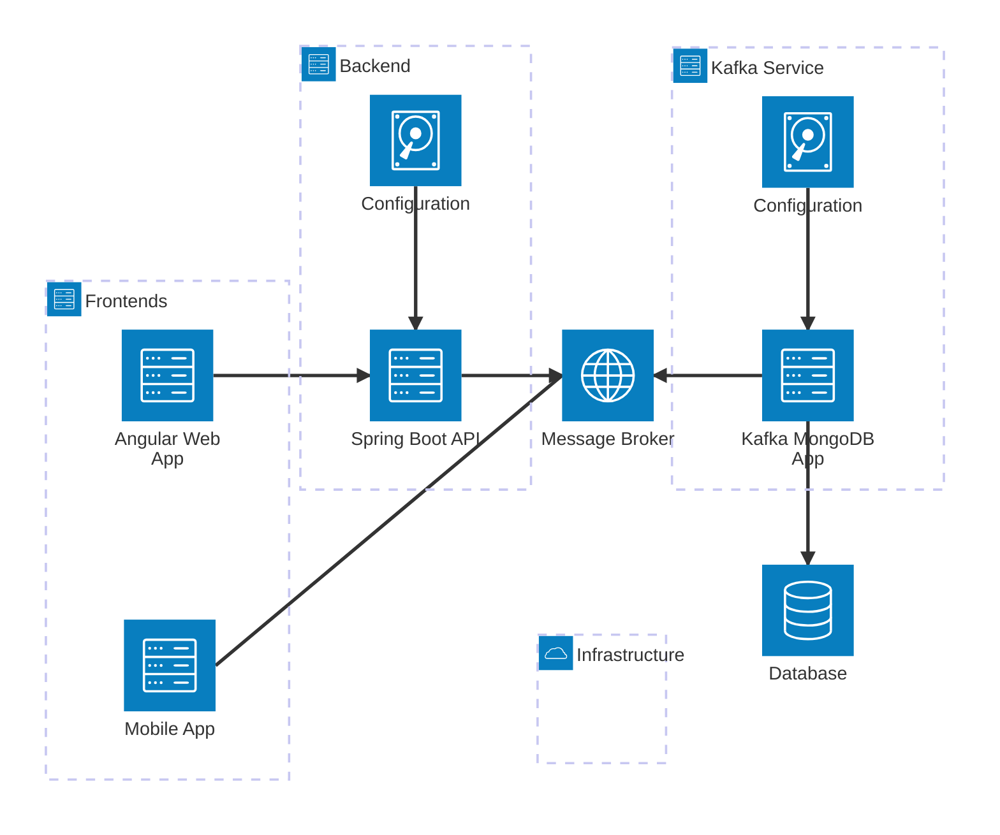

```mermaid
architecture-beta


    group frontend_group(server)[Frontends]
        service angular(server)[Angular Web App] in frontend_group
        service mobile(server)[Mobile App] in frontend_group

    group backend_group(server)[Backend]
        service api(server)[Spring Boot API] in backend_group
        service properties(disk)[Configuration] in backend_group
    group kafka_group(server)[Kafka Service]
        service kafka_app(server)[Kafka MongoDB App] in kafka_group
        service kafka_config(disk)[Configuration] in kafka_group

    group infrastructure(cloud)[Infrastructure]
        service database(database)[Database]
        service messaging(internet)[Message Broker]

    angular:R --> L:api
    mobile:R --> L:messaging
    api:R --> L:messaging
    kafka_app:L --> R:messaging
    kafka_app:B --> T:database
    properties:B --> T:api
    kafka_config:B --> T:kafka_app
```
